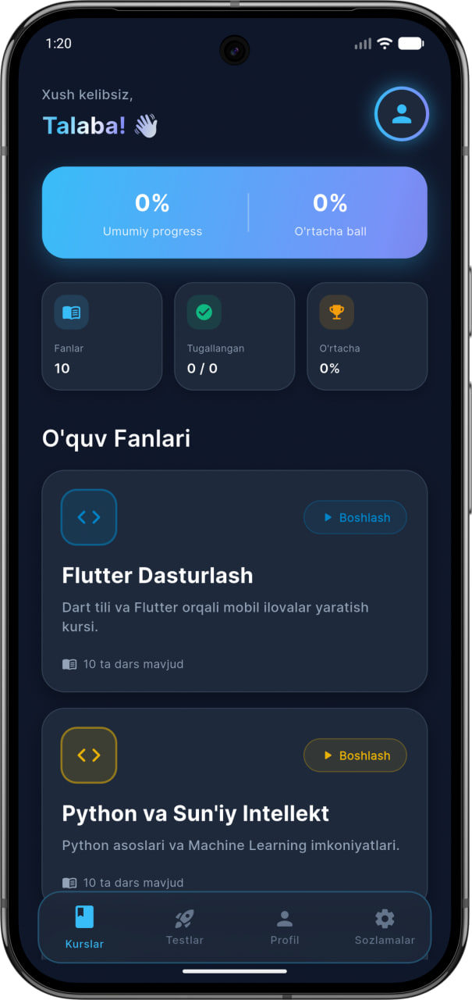
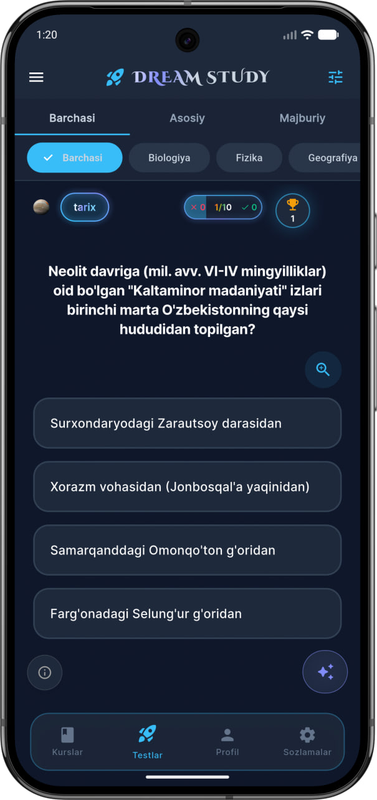
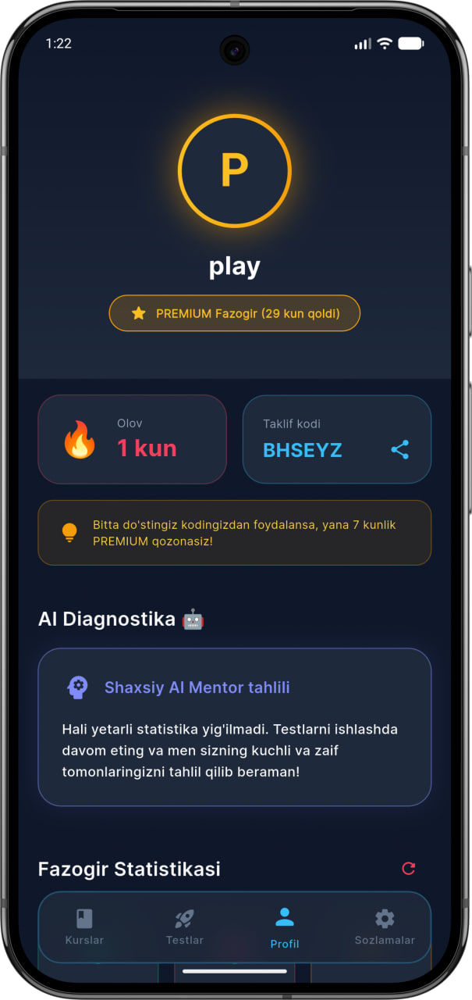

# 🚀 Dreamstudy - Next-Gen AI EdTech Platform

> **Note:** This is a showcase repository. The full source code (150+ files, Clean Architecture) is kept private as this is a commercial startup project. Below you can find the architecture overview and some code samples.

## 📱 Live Demo & Download
* **Android App:** 
* **Web App:**[dreamstudy.uz](https://dreamstudy.uz)
* **Admin Panel:** [panel.dreamstudy.uz](https://panel.dreamstudy.uz)

## 💡 About the Project
Dreamstudy is an AI-powered EdTech platform built for Central Asian students. It features an AI Mentor (Gemini 2.5), AI Test Generator from images, and Real-time Multiplayer Duels.

## 🛠 Tech Stack
* **Frontend:** Flutter, Riverpod, GoRouter
* **Backend:** Firebase (Auth, Firestore, Realtime Database)
* **AI:** Google Generative AI (Gemini 2.5 Flash/Pro)
* **Local Storage:** Hive, SharedPreferences

## 📸 Screenshots

  
  
  

## 🧠 Code Architecture (Sample)
I used Clean Architecture and Repository Pattern. You can view sample codes in the `lib_samples/` folder in this repo.
